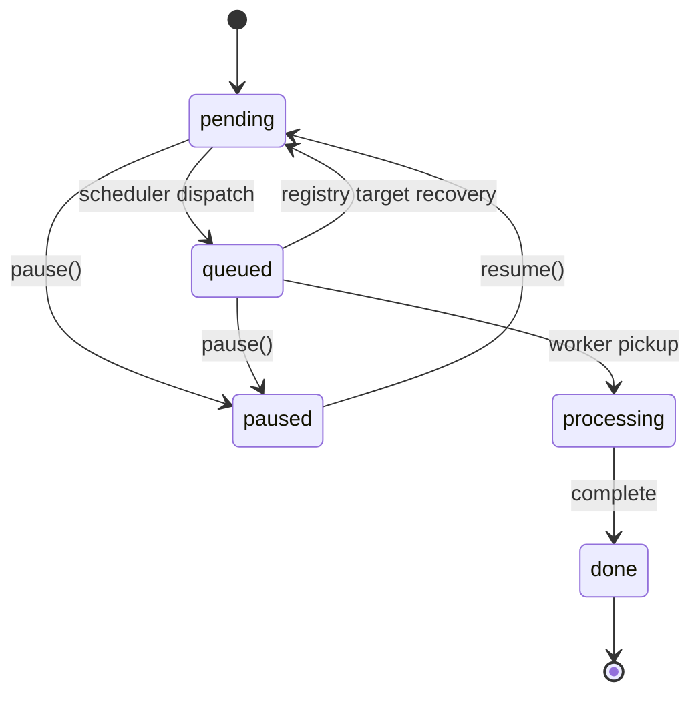

# Queue Scheduling & Back Pressure

## Overview

The scheduling system decouples request ordering from message delivery. MongoDB is the scheduling brain — it stores priority, enforces pause/resume state, and determines dispatch order. Azure Storage Queues remain the notification channel that wakes workers, but are kept deliberately shallow so scheduling decisions in MongoDB take effect within seconds.

## Architecture

```
┌────────────────────────────────────────────────────────────────────────┐
│                          MongoDB (requests)                            │
│                                                                        │
│  priority: number (root, request-scoped)                               │
│  run.status: pending | queued | paused | processing | done             │
│  run.pausedAt / run.resumedAt (per-attempt)                            │
│                                                                        │
│  Compound index: run.status + workerType + deletedAt + priority + date │
└──────────────────────────────┬─────────────────────────────────────────┘
                               │
               ┌───────────────▼───────────────┐
               │     Request Scheduler          │
               │     (apps/scheduler/)          │
               │     1 replica, polls every 2s  │
               │                                │
               │  Refresh agent registry        │
               │  Group active targets by       │
               │    advertised queueName        │
               │                                │
               │  findOneAndUpdate              │
               │    filter: status=pending      │
               │            exact worker+ver    │
               │    sort: priority DESC,        │
               │          createdAt ASC         │
               │    set: status → queued        │
               │                                │
               │  Caps queue at targetDepth     │
               │  via getProperties() count     │
               └───────────────┬───────────────┘
                               │
               ┌───────────────▼───────────────┐
               │   Azure Storage Queues         │
               │   (shallow buffer, ≤5 msgs)    │
               │   names advertised by active   │
               │   AgentVersion records         │
               └───────────────┬───────────────┘
                               │
               ┌───────────────▼───────────────┐
               │   Workers                      │
               │   Poll queue → fetch doc →     │
               │   check status (skip paused)   │
               │   → process                    │
               └───────────────────────────────┘
```

## Data Model

### Priority

`priority` is a root-level integer on `RequestDocument`. Higher values are dispatched first. Default is `0`.

| Value | Use case |
|-------|----------|
| 100 | Critical / demo |
| 50 | High / blocking PR |
| 0 | Normal (default) |
| −50 | Low / nightly batch |

Priority is request-scoped (survives retries). The range is unrestricted but the portal offers −10 to +10 via the bulk dialog, with ±1/±5 increment buttons.

Priority can only be changed on `pending` and `paused` requests — the API endpoints enforce this server-side. Changing priority on a `queued` request is not allowed because the message is already in the Azure queue where ordering cannot be changed. `processing` and `done` requests are immutable.

### Status Lifecycle



| Status | Meaning |
|--------|---------|
| `pending` | Awaiting scheduler dispatch. Can be paused. |
| `queued` | Dispatched to the Azure queue recorded in `run.queuedQueueName`, awaiting worker pickup. Can be paused. |
| `processing` | Worker actively running. Cannot be paused. |
| `paused` | Held — scheduler skips. Resume returns to `pending`. |
| `done` | Terminal (outcome: succeeded / failed / finished). |

`pausedAt` and `resumedAt` are per-attempt fields in `RunState`. On retry, a fresh `RunState` is created with `status: "pending"`.

## Request Scheduler

**Location**: `apps/scheduler/` — standalone K8s Deployment (1 replica, `Recreate` strategy).

### Dispatch Loop

Every 2 seconds (configurable via `SCHEDULER_POLL_INTERVAL_MS`):

1. Read the agent registry and keep only non-deleted agents with `available: true` and active versions whose `queueName` is non-empty.
2. Build one exact worker/version target per advertised queue. If legacy or racing
   registry writes assign a queue to multiple targets, fail that queue closed and emit
   `scheduler.registry_queue_conflict`.
3. Every 30 seconds (configurable via
   `SCHEDULER_QUEUE_RECONCILIATION_INTERVAL_MS`), reconcile queued requests
   against the refreshed registry. Requests whose target disappeared, whose
   queue changed, or whose legacy record lacks `run.queuedQueueName` return
   atomically to `pending`; workers discard messages from the superseded
   dispatch. Between reconciliations, reuse the cached queued-request counts and
   increment them for successful dispatches.
4. Count queued requests per exact worker/version target from MongoDB and read the physical
   Azure queue depth. Compute available slots from the greater count so stale queue messages
   or an eventually consistent queue-depth read cannot overfill the queue.
5. `findOneAndUpdate` the highest-priority pending request within that target:
   - Filter: `run.status: "pending"`, exact `workerType` + `agentVersion`, no `deletedAt`
   - Sort within the target: `priority: -1, createdAt: 1`
   - Update: set `run.status: "queued"` and `run.queuedQueueName` to the advertised queue
6. Send `{ requestId, runId, workerType, agentVersion }` to that advertised Azure Storage Queue. If the send fails, retry the idempotent queued-to-pending rollback. Exhausted rollback failures emit `scheduler.claim_rollback_failed`.

Each exact target owns a dedicated physical queue and therefore has an independent
shallow-buffer budget. Registering a new version of the same agent on its existing
queue atomically retires the previous owner, so the last successful registration
wins. The registry API rejects reuse by a different agent; the scheduler independently
detects legacy or racing conflicts and dispatches nothing to the conflicted queue.

The registry is refreshed on every cycle, so registrations, retirements,
availability changes, and queue changes take effect without restarting the
scheduler. Already-queued requests are recovered to pending before dispatch when
their exact target is no longer routable or advertises a different queue.
Pending requests whose target is missing, deleted, unavailable,
inactive, versionless, or missing a queue are not claimed. The scheduler emits
`scheduler.invalid_pending_target` and `scheduler.invalid_pending_requests`
telemetry with an actionable reason whenever that invalid-target set changes.
The diagnostic scan is rate-limited and isolated from dispatch; a failed
inspection emits `scheduler.invalid_target_inspection_failed` but does not stop
valid queues from being filled.

### Configuration

Scheduler environment variables (set on the scheduler Deployment):

| Variable | Value | Purpose |
|----------|-------|---------|
| `SCHEDULER_TARGET_QUEUE_DEPTH` | 5 | Target queued-request depth for each exact worker/version |
| `SCHEDULER_POLL_INTERVAL_MS` | 2000 | Polling interval in ms |
| `SCHEDULER_QUEUE_RECONCILIATION_INTERVAL_MS` | 30000 | MongoDB queued-request reconciliation interval in ms |

There is no scheduler worker inventory and no queue naming convention.
`AgentVersion.queueName` is authoritative. In particular,
`SCHEDULER_WORKER_TYPES` and per-worker queue-depth variables are not supported.

### Why Keep the Queue Shallow?

Once a message is in Azure Storage Queue, it cannot be reordered or removed. By capping each discovered queue at a shallow target depth:

- **Priority takes effect immediately**: high-priority requests get dispatched on the next tick
- **Pause takes effect immediately**: paused requests are never dispatched
- **Priority changes are respected**: pending requests re-sort on the next tick

### Back Pressure

The scheduler provides natural back pressure. When workers are busy, messages sit in the queue and the greater of `approximateMessagesCount` and the MongoDB queued-request count stays at or above `targetQueueDepth`. The scheduler sees zero available slots and stops dispatching — pending requests accumulate in MongoDB where they remain re-prioritizable and pausable.

When workers finish and drain messages, slots open up and the scheduler fills them on the next tick (≤2s). This creates a pull-based flow: workers pull work at their own pace, and the scheduler never overwhelms them regardless of how many requests are pending in MongoDB.

If worker replicas scale up, increase `SCHEDULER_TARGET_QUEUE_DEPTH`. The same target depth is applied independently to every discovered queue and should
be high enough to keep the largest worker pool supplied.

## Worker Behavior

Workers are unchanged except for one guard: after fetching a document from MongoDB, if `run.status === "paused"`, the worker deletes the queue message and moves on. This handles the race where a request was paused after being queued but before the worker picked it up.

### Liveness Heartbeat & Redelivery

Azure Storage Queues guarantee at-least-once delivery, so a worker may receive a duplicate of a message that another worker is already processing (e.g. transient visibility-extension miss, throttling). To distinguish a spurious redelivery from a genuine worker crash, every in-flight run carries:

| Where | Field | Type | Meaning |
|-------|-------|------|---------|
| Mongo (`run.*`) | `worker` | `{ instanceId, podName? }` | Identity of the worker process currently processing the run. `instanceId` is a per-process UUID; `podName` is the K8s pod name (`HOSTNAME`) when running in a pod. Stamped atomically at the `queued → processing` pickup. Persisted for forensics; never updated by heartbeat ticks. |
| Mongo (`run.*`) | `startedAt` | `Date` | Wall-clock time of the pickup. Used as the missing-heartbeat fallback (see below). |
| Redis | `run-heartbeat:<runId>` | `Date` (ISO string, TTL ≈ 5×visibility) | Wall-clock time the owning worker last beat. Refreshed every 15s by the per-run liveness loop in [`startVisibilityHeartbeat`](../../packages/shared/src/queue/visibility-heartbeat.ts). This loop runs on a **dedicated `setInterval`, fully decoupled from the queue-visibility extension** — so a transient/slow `queueClient.updateMessage` (e.g. Azure Storage under concurrent load) can never starve the liveness write and get a healthy, busy worker reaped (issue #1064). |

**Why Redis for the heartbeat?** The previous design wrote `run.lastHeartbeatAt` to Mongo on every beat. With CosmosDB-compatible Mongo each beat costs ~10 RU, so an active run burns ~40 RU/min just to stay alive. The heartbeat is inherently ephemeral — it has no value past its TTL — so it lives in Redis. The API enriches `processing` runs on response with the latest beat (a batch read) so the portal still sees `run.lastHeartbeatAt` (transient, not persisted in Mongo).

> **Shard-safe batch reads (clustered Redis).** The batch read in [`RedisHeartbeatStore.mget`](../../packages/shared/src/queue/heartbeat-store.ts) delegates to the [`clusterSafeMget`](../../packages/shared/src/queue/cluster-safe-mget.ts) helper, which issues a **pipeline of single-key `GET`s**, not a native multi-key `MGET`. On a clustered Redis (e.g. Azure Cache for Redis with the Enterprise clustering policy) a multi-key `MGET` whose keys span hash slots fails with `CROSSSLOT`; the store's error handling would swallow that into an *empty* map, which silently made every `processing` run look heartbeat-less — falsely reaping healthy runs and blanking heartbeats on the runs **list** view, while single-key reads (run detail / side panel) kept working (issue #1064). Single-key `GET`s are always shard-routable, so the pipeline is correct on standalone and clustered Redis alike and isolates a per-key error instead of discarding the whole batch. The same helper backs both consumers of the batch read — the stuck-run reaper sweep and the API runs-list enrichment — so they cannot drift.

When a worker dequeues a message whose `run.status === "processing"`, it consults Redis:

- **Fresh** (last beat ≤ `staleThresholdMs` ago): the original worker is alive. **Re-defer** the duplicate message — stop this duplicate consumer's own visibility heartbeat first (to stabilize the popReceipt), then push the message's visibility out by `SCOPE_RUN_REDELIVER_DEFER_MS` (default = `staleThresholdMs`) and return **without deleting it**. Leave the run untouched, log a `warn`.
- **Stale** (last beat older than threshold): the worker is presumed dead. Mark the run failed via an atomic `findOneAndUpdate` filtered on `run.worker.instanceId === <currentOwnerId>` — if a peer has already taken over (rewriting the worker identity) between our read and write, our claim no-ops and we drop the dupe. Drop the Redis key. The user retries explicitly via `POST /requests/:id/retry`.
- **Missing** (no Redis key — first dequeue race, or Redis blip, or key TTL'd out): fall back to `run.startedAt`. If the run was picked up *recently* (≤ `staleThresholdMs` ago), treat as the "no first beat yet" race and re-defer the dupe — this prevents a transient Redis outage from mass-failing healthy just-picked-up runs. Otherwise, treat as stale and mark failed.

> **Why re-defer instead of delete?** Recovery of a `processing` run whose worker dies hard (OOM/SIGKILL — no graceful failure write) relies on the queue redelivering its message so a healthy worker eventually sees the stale heartbeat. The *only* trigger is that the message still exists. If a fresh-heartbeat duplicate were **deleted**, the recovery token would be destroyed: worker A loses its popReceipt → worker B dequeues the dupe, sees A's fresh beat, deletes the message → A then dies hard → the run is `processing` with **no queue message in existence**, and the scheduler only dispatches `pending` runs. Re-deferring keeps the token alive: each time the message resurfaces, a fresh beat re-defers (cheap), a stale beat marks failed. The terminal-`done` guard still deletes the message when a later worker dequeues it after the original completed successfully — so "run completed, but the queue message still exists" is a normal, self-healing outcome.

The default threshold is `2 × HEARTBEAT_VISIBILITY_SECONDS` (= 120s). Override with the `SCOPE_RUN_HEARTBEAT_STALE_MS` env var (milliseconds). The Redis TTL defaults to `5 × HEARTBEAT_VISIBILITY_SECONDS` (= 300s); override with `SCOPE_RUN_HEARTBEAT_REDIS_TTL_MS`.

### Stuck-Run Reaper (scheduler backstop)

Queue redelivery is best-effort: if a message ever expires (Azure queue TTL, default 7 days) or is lost, a `processing` run with a dead worker would stay stuck forever because the scheduler only dispatches `pending` runs. The **`StuckRunReaper`** ([`apps/scheduler/src/stuck-run-reaper.ts`](../../apps/scheduler/src/stuck-run-reaper.ts)) is the authoritative backstop, modeled on the `PostProcessorDispatcher` polling loop. Each sweep (every `SCOPE_REAPER_POLL_INTERVAL_MS`, default 60s):

1. **Pings Redis first.** If the heartbeat store is unreachable, the sweep is **skipped entirely** — a Redis blip must never be read as "all workers dead". `mget` returning zero beats for a non-empty candidate set triggers a re-ping; if that also fails, skip.
2. **Finds candidates** with an indexed query on `run.status: "processing"` (+ not soft-deleted) only — no `run.startedAt` range predicate, to stay on the single-field `run.status` index and avoid needing a range index on CosmosDB. The `startedAt` cutoff (older than `staleThresholdMs`) is applied **in memory** to the small candidate batch (missing `startedAt` is treated as old).
3. **Reads heartbeats** for the candidates and keeps only those whose beat is stale/missing using the *same* staleness rule as the redelivery handler.
4. **Two-strikes:** a run must look stale in **two consecutive sweeps** before it is reaped (`toReap = currentStale ∩ previouslyStale`), absorbing transient blips.
5. **Confirmation re-read:** immediately before failing a run, its heartbeat is re-read with a **single-key `GET`**. The sweep verdict comes from a batch read; this direct read is always shard-routable, so a fresh beat here aborts the reap regardless of why the batch read missed it (defense-in-depth against the clustered-Redis `MGET` failure above — issue #1064).
6. **Circuit-breaker:** if a single sweep would reap more than `SCOPE_REAPER_MAX_PER_SWEEP` (default 30) runs, it skips and logs loudly — a high count implies a systemic slowdown (e.g. CosmosDB 429 storm), not N independent worker deaths.
7. **Atomic claim** per run via `findOneAndUpdate` gated on `_id` + `run._id` + `run.status: "processing"` + the current `run.worker.instanceId` (or `{$exists:false}`). The loser of any reaper↔worker / cancel / retry race no-ops. On success it sets a terminal `failed` outcome with a **reaper-specific** `run.error` (distinct from the redelivery handler's "presumed dead" wording, so the two recovery paths are distinguishable in forensics) and deletes the Redis key. It leaves `postProcessorStatus` **unset** so the existing `PostProcessorDispatcher` enqueues post-processing (the reaper has no queue client — this avoids a set-then-send rollback hazard).

**Redis is non-fatal to the scheduler.** The reaper is **disabled by default**; it is constructed only when `SCOPE_REAPER_ENABLED === "true"` *and* `REDIS_HOST` is set, wrapped in try/catch; a construction or connection failure self-disables the reaper while the dispatch loop keeps running, and the `/` health probe stays Redis-independent. A false positive (the reaper reaping a slow-but-alive owner) is **safe, not corrupting**: the worker's terminal success write is status-gated on `run.status: "processing"`, so once the reaper flips the run to `failed` the worker's final write no-ops. The cost is a wasted in-flight run (the user retries), never a double-fail or a revived run.

## API Endpoints

### Single Request

```
POST /api/v1/requests/:id/pause       Pause (pending/queued → paused)
POST /api/v1/requests/:id/resume      Resume (paused → pending)
POST /api/v1/requests/:id/priority    Set priority { priority: number }
```

### Bulk Operations

```
POST /api/v1/requests/bulk-pause      { ids: string[] }
POST /api/v1/requests/bulk-resume     { ids: string[] }
POST /api/v1/requests/bulk-priority   { ids: string[], priority: number }
```

All endpoints use POST. Bulk endpoints return `{ updated, skipped }` counts. Priority endpoints filter server-side to only update `pending` and `paused` requests.

### Submit

`POST /api/v1/requests` accepts an optional `priority` field (default: 0). The API inserts with `run.status: "pending"` — it no longer sends directly to the queue. The scheduler handles dispatch.

## Portal UI

### Runs List Toolbar

The bulk action bar appears when runs are selected. Buttons progressively collapse labels at narrower viewports (icons always visible, tooltips on all buttons):

| Breakpoint | Visible |
|------------|---------|
| ≥ 2xl | Section labels + all button text |
| xl–2xl | Button text only (section labels hidden) |
| lg–xl | Core action text (Pause/Resume/Retry); Export text hidden |
| md–lg | Only Pause/Resume/Retry text; Priority/Re-submit icon-only |
| < md | All icon-only |

Buttons are disabled (not hidden) when the action doesn't apply to the selection. `selectionCaps` computes pausable/resumable/prioritizable/retryable counts from either the flat `runs` array (flat mode) or group-level `statusCounts` (grouped mode).

The bulk priority dialog has −5/−1/input/+1/+5 increment controls and pre-fills with the current priority of selected runs.

### Run Detail Page

The header shows context-sensitive schedule actions alongside existing Retry/Archive buttons:

- **Pause** — visible when status is `pending` or `queued`
- **Resume** — visible when status is `paused`
- **Priority** dropdown — visible when `pending` or `paused`, with preset levels (−10 to +10)

All actions are hidden when viewing a historical attempt.

### Per-Row Actions

Each row in the runs table has inline icon buttons for Pause (pending/queued), Resume (paused), Priority dropdown (pending/paused), and Retry (done).

### Status Display

- `queued` → purple badge
- `paused` → warning/amber badge
- Group rows show stacked status progress bars with all 5 states

## Infrastructure

### Kubernetes Resources

| Resource | File |
|----------|------|
| Scheduler in docker-compose | `docker-compose.yml` (service: `scheduler`) |

### Queue Inventory

The scheduler has no static queue inventory. Inspect active
`AgentVersion.queueName` values in the agent registry to see the current queues.
Each non-deleted active agent version must own a distinct queue. Workers still
compare the request's exact worker/version and recorded `run.queuedQueueName`
with their runtime identity as defense in depth against stale or legacy messages.
The atomic `queued → processing` claim also requires the worker's current queue
name, closing the race where a run is reassigned after the worker's initial read.

## Key Files

| File | Role |
|------|------|
| `apps/scheduler/src/request-scheduler.ts` | Scheduler core: dispatch loop, queue depth management |
| `apps/scheduler/src/index.ts` | Entry point: config parsing, MongoDB/Queue setup, health server |
| `apps/api/src/routes/requests.ts` | Pause/resume/priority endpoints (single + bulk) |
| `packages/shared/src/types/types.ts` | `priority`, `queued`/`paused` status, `pausedAt`/`resumedAt` |
| `packages/shared/src/queue/base-queue-processor.ts` | Worker paused-check guard |
| `apps/portal/src/pages/RunsList.tsx` | Bulk actions toolbar, per-row actions |
| `apps/portal/src/pages/RunDetail.tsx` | Detail page schedule actions |
| `apps/api/src/grouping.ts` | Group aggregates (includes `llmCalls`) |
